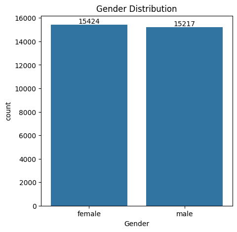
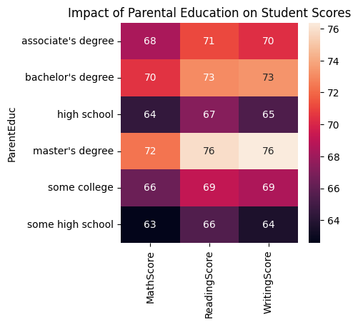
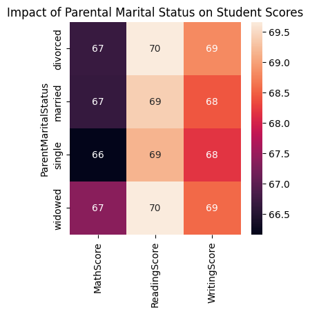
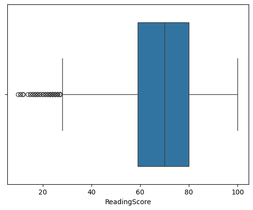
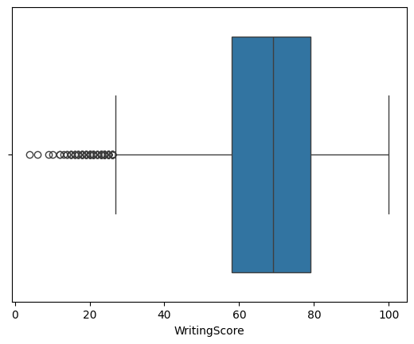
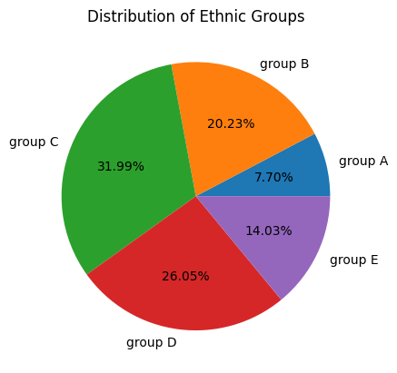
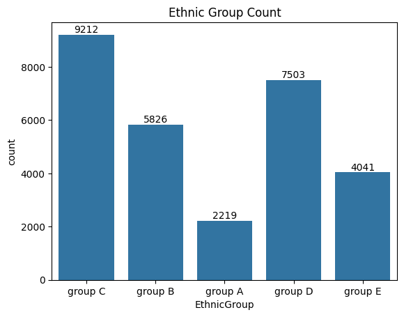

# Student Result Analysis

## Project Overview

This project provides a comprehensive data analysis of the factors that influence student academic performance across Math, Reading, and Writing subjects. The analysis identifies correlations between demographic and socioeconomic factors (such as parental education, gender, ethnicity, and marital status) and student achievement.

## Project Structure

```text
Student-Result-Analysis/
├── analysis.ipynb                   # Main Jupyter notebook containing the analysis
├── student_scores.csv               # Dataset with student information and scores
├── plots/                           # Generated visualization assets
│   ├── gender_distribution.png
│   ├── parent_education_vs_student_score.png
│   ├── marital_status_vs_student_score.png
│   ├── math_score_distribution.png
│   ├── reading_score_distribution.png
│   ├── writing_score_distribution.png
│   ├── ethnic_group_distribution.png
│   └── ethnic_group_count.png
├── README.md                        # Project documentation
└── project 2.ipynb                  # Backup of original analysis
```

## Dataset Description

The dataset encompasses the following student attributes:
- Demographics: Gender, Ethnic Group
- Family Background: Parent Education Level, Parent Marital Status
- Academic Performance: Math Score, Reading Score, Writing Score
- Other Factors: Lunch Type, Test Preparation, Study Hours, Sports Practice

## Notebook Structure

The analysis notebook is organized into three main sections:

1. **Import Libraries and Load Data** - Loads the dataset and performs initial exploratory checks (head, describe, info)
2. **Data Cleaning and Preprocessing** - Removes unnecessary columns and fixes data entry errors in the weekly study hours
3. **Exploratory Data Analysis (EDA)** - Generates comprehensive visualizations and analyzes:
   - Gender distribution
   - Impact of parental education on student scores
   - Impact of parental marital status on student scores
   - Score distributions for Math, Reading, and Writing
   - Ethnic group representation in the dataset

## Visualizations and Plots

### 1. Gender Distribution

This visualization displays the count of male and female students in the dataset. The data shows a slightly higher proportion of female students compared to male students.

### 2. Impact of Parental Education on Student Scores

This heatmap illustrates the relationship between parental education levels and average student performance in Math, Reading, and Writing. Students with parents holding higher education degrees demonstrate consistently better performance across all academic subjects.

### 3. Impact of Parental Marital Status on Student Scores

This heatmap shows the correlation between parental marital status and student academic performance. Parental marital status exhibits no significant correlation with student academic performance.

### 4. Math Score Distribution

Box plot showing the distribution of Math scores among students, detailing central tendencies, score ranges, and outliers.

### 5. Reading Score Distribution

Box plot displaying the distribution of Reading scores, revealing the range and spread of student performance in this subject.

### 6. Writing Score Distribution

Box plot presenting the distribution of Writing scores, illustrating student performance patterns and variability in this subject.

### 7. Ethnic Group Distribution


These visualizations show the representation of the five distinct ethnic groups in the dataset. The pie chart displays the percentage distribution, while the count plot shows the absolute number of students from each ethnic group.

## Key Analyses and Findings

1. Parental Education Impact
Students with parents holding higher education degrees (master's degree, bachelor's degree) demonstrate consistently better performance across all academic subjects.

2. Gender Distribution
The dataset contains a slight female majority, allowing for a balanced gender representation.

3. Marital Status Impact
Parental marital status exhibits no significant correlation with student academic performance.

4. Score Distribution Analysis
Box plots generated for Math, Reading, and Writing scores detail central tendencies, score ranges, and outliers.

5. Ethnic Group Analysis
The dataset encompasses representation from five distinct ethnic groups.

## Technologies Used

- Python 3.x
- Pandas
- NumPy
- Matplotlib
- Seaborn

## Key Findings Summary

- **Parental Education Impact**: Students with parents holding higher education degrees (Bachelor's, Master's) consistently score better across all subjects (Math, Reading, Writing).
- **Gender Distribution**: The dataset shows a slight female majority, providing relatively balanced gender representation.
- **Marital Status Impact**: Parental marital status exhibits no significant correlation with student academic performance.
- **Score Distribution**: Math, Reading, and Writing scores show relatively normal distributions with comparable ranges and outliers.
- **Ethnic Representation**: The dataset includes representation from five distinct ethnic groups with reasonably balanced distribution across all groups.

## Getting Started

### Prerequisites

Ensure Python is installed along with the required libraries:

```bash
pip install pandas numpy matplotlib seaborn jupyter
```

### Running the Analysis

1. Clone or download the repository to the local machine.
2. Navigate to the project directory.
3. Ensure the dataset file `student_scores.csv` is in the project directory.
4. Launch Jupyter Notebook:
   ```bash
   jupyter notebook
   ```
5. Open `analysis.ipynb`.
6. Run all cells sequentially to reproduce the analysis and generate the visualizations in the `plots/` folder.

## License

This project is distributed under the MIT License.